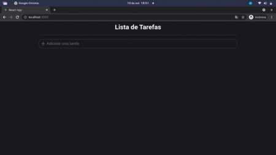

# Lista de Tarefas 

## Projeto desenvolvido com TypeScript

<h1 align="center">
    
</h1>

### Rodando o projeto
~~~bash
# Clone este repositório
$ git clone <https://github.com/Demanuel001/Lista-Tarefas-React.git>

# Acesse a pasta do projeto no terminal/cmd
$ cd Lista-Tarefas-React

# Dependências.
$ npm install styled-components
$ npm install -D @types/styled-components

# Execute a aplicação em modo de desenvolvimento.
$ npm start

~~~
